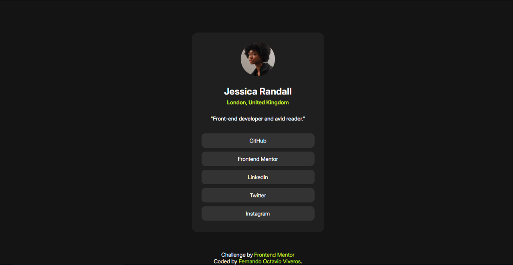

# Frontend Mentor - Social links profile solution

Esta es la solucion del desafío [Social links profile challenge on Frontend Mentor](https://www.frontendmentor.io/challenges/social-links-profile-UG32l9m6dQ). 

## Tabla de contenidos

- [Descripción](#descripcion)
  - [El desafío](#el-desafio)
  - [Captura de pantalla](#captura-de-pantalla)
  - [Links](#links)
- [Construido con](#construido-con)
- [Autor](#autor)

## Descripción

### El desafío

Los usuarios deben ser capaces de:

- Ver los estados de hover y enfoque para todos los elementos interactivos en la página

### Captura de pantalla

### Links

- Solucion URL: [https://github.com/agros55/social-links-profile](https://github.com/agros55/social-links-profile)
- Live Site URL: [https://agros55.github.io/social-links-profile/](https://agros55.github.io/social-links-profile/)

## Construido con

- HTML5
- CSS3
- Flexbox

## Autor

- GitHub - [agros55](https://github.com/agros55/)
- Frontend Mentor - [@agros55](https://www.frontendmentor.io/profile/agros55)
